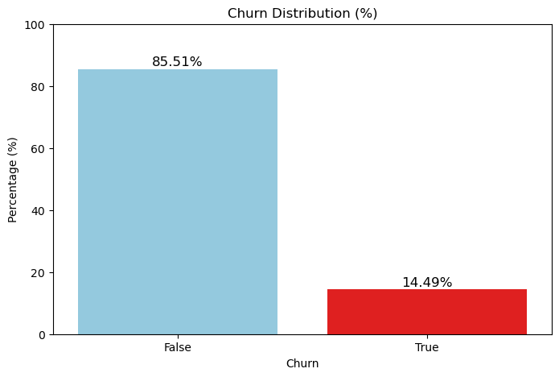
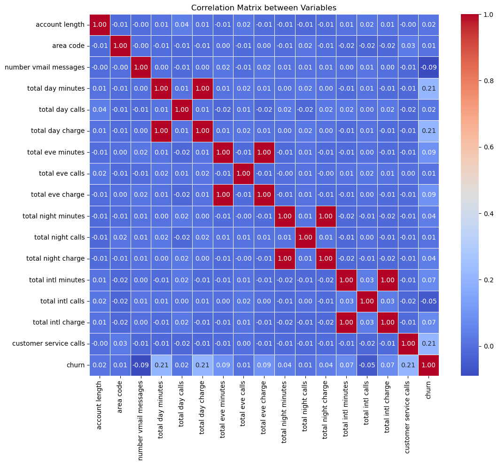
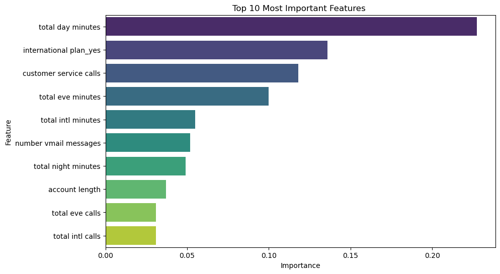
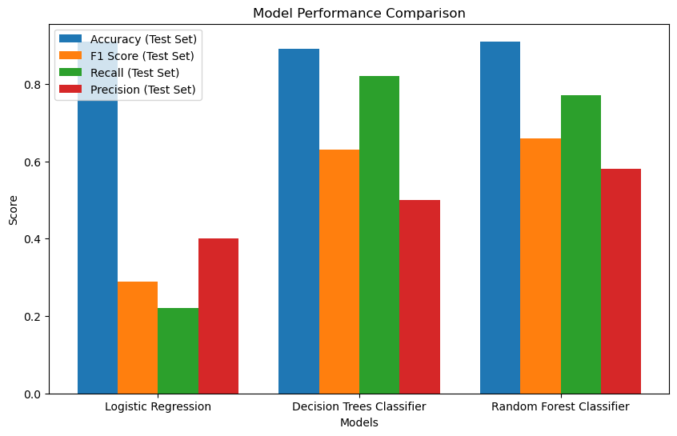
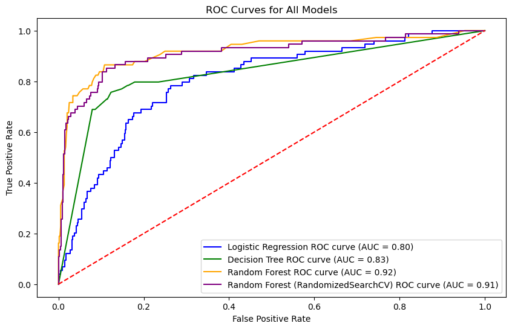

## Machine Learning Model for Predicting Syriatel Customer Churn

### Project Overview
This project aims to support SyriaTel in addressing customer churn by developing a classification model that predicts whether a customer is likely to stop doing business with the company in the near future. By accurately predicting customer churn, SyriaTel can take early action to address customer dissatisfaction, implement targeted retention measures, and strengthen customer loyalty. Ultimately, this will help reduce churn rates, improve customer satisfaction, and enhance the company’s competitive position in the market.

### Business Understanding
SyriaTel is a telecommunications company that provides mobile network services in Syria. Recently, the company has experienced rising customer attrition rates, which pose a serious threat to revenue stability and market share. Customer churn is a metric showing when a subscriber or a regular customer cancels his subscription or stops doing business with a company. This challenge highlights the need to better understand the key factors contributing to customer churn. Identifying the drivers of customer defection and developing proactive retention strategies is essential for maintaining profitability and remaining competitive in the telecommunications industry.

### Problem Statement:
As SyriaTel navigates a competitive telecommunications landscape, the increasing attrition of
customers poses a significant challenge to its growth and profitability. By analyzing the
factors contributing to churn, SyriaTel can adopt proactive measures to enhance customer
satisfaction and loyalty, ultimately improving retention rates thereby ensuring sustained
profitability in a competitive market.
### Objectives:
1. Identify Churn Patterns, develop a Prediction model and give business recommendations to the Syriatel stakeholder:
### Data Understanding
The Customer Churn in Telecom’s dataset is from Kaggle which contains information about customer activity and whether or not they canceled their subscription with the Telecom firm. The goal of this dataset is to develop predictive models that can help the telecom business reduce the amount of money lost due to customers who don’t stick around for very long.
The dataset contains 3333 entries and 21 columns, including information about the state, account length, area code, phone number, international plan, voice mail plan, number of voice mail messages, total day minutes, total day calls, total day charge, total evening minutes, total evening calls, total evening charge, total night minutes, total night calls, total night charge, total international minutes, total international calls, total international charge, customer service calls and churn.
### Data preparation.
The dataset was first inspected for missing values and duplicate records. Categorical variables were then encoded into numerical format to make them suitable for machine learning analysis. No missing or duplicate values were found in the dataset.
* Exploratory Data Analysis (EDA)
Exploratory analysis was conducted using univariate, bivariate, and multivariate techniques to understand feature distributions and examine relationships between variables, including their correlation with the target variable.
The Churn column was defined as the target variable, while all other variables (excluding the phone number column) were used as predictors.
The distribution of the target variable is shown below:

To addres skewed distribution of some features, appropriate scaling and normalization techniques were applied resulting in more normalized feature distributions for data analysis and modelling.
A correlation matrix as shown below shows there is a very low correlation between most features.However, there is a perfect positive correlation between total charge and total minutes at different times. This is expected since the charge of a call depends on the length of the call in minutes.
total day minutes, total day charge and customer service calls have a weak positive correlation with churn. The other features have a negligible correlation with churn, approximately 0.

### Feature Engineering and Data Preprocessing
To improve model performance and ensure reliable predictions, several preprocessing steps were applied to the dataset.
* Multicollinearity handling: Features representing total charges at different times were removed to reduce multicollinearity among predictors.
* Train-test split: The dataset was divided into training and testing sets to evaluate model performance on unseen data.
* Encoding categorical variables: Categorical features were transformed into numerical format using dummy (one-hot) encoding.
* Class imbalance handling: SMOTE (Synthetic Minority Over-sampling Technique) was applied to address class imbalance by generating synthetic samples of the minority class.
### Feature importances
total day calls, total eve calls, total night calls, international calls and customer service calls are the most important features in predicting customer churn as shown 

### Modelling
Three classification models—Logistic Regression, Decision Tree, and Random Forest—were evaluated to determine the most effective approach for predicting customer churn.
To ensure fair comparison and prevent data leakage, feature scaling was incorporated within a pipeline and applied consistently during model training and evaluation.
The bar graph represents the 3 models evaluated. 

The ROC Curves and AUC calculations for the different models are also shown are also shown.

The Random Forest model has a higher Area Under the Curve (AUC) and better classification performance, making it the most effective model.
The metrics is as shown. 

Based on the provided metrics, the Random Forest Classifier achieved the highest accuracy (91.00%) and F1-score (66.00%). The Decision tree classifier had the highest recall (82.00%), while the Random Forest Classifier achieved the highest precision (58.00%). The Random Forest Classifier is the best-performing model overall and so I selected it as my best model.
### Conclusion
The analysis of the dataset indicates that customer churn can be effectively predicted using machine learning models. Of the models evaluated, the Random Forest Classifier is recommended as it shows the strongest overall performance. It achieves a higher ROC curve that closely approaches the top-left corner, reflecting a high AUC (Area Under the Curve) and strong ability to distinguish between churn and non-churn customers.
Based on these results, it is recommended that Syriatel adopt the Random Forest Classifier as the primary model for churn prediction. This model performs consistently well across key evaluation metrics, including accuracy, F1-score, recall, and precision on the test set, making it a reliable choice for identifying customers who are at risk of leaving.
Key features influencing customer churn include:
* Total day minutes: total duration of daytime calls
* Total evening minutes: total duration of evening calls
* Customer service calls: number of interactions with customer support
* Total international minutes: total duration of international calls
### Business recommendations for Syriatel Company
From a strategic perspective, Syriatel should implement customer retention initiatives that target the key drivers of churn, particularly those related to call usage and pricing. This may include offering personalized discounts or more competitive rates for daytime usage to encourage continued customer engagement and reduce attrition.
In addition, the company should focus on improving customer service efficiency and satisfaction. Since the number of customer service calls is a significant predictor of churn, reducing the need for repeated or unresolved support interactions could help improve customer experience and retention.
Overall, by addressing these key factors, Syriatel can reduce churn rates, strengthen customer loyalty, and minimize revenue loss.

